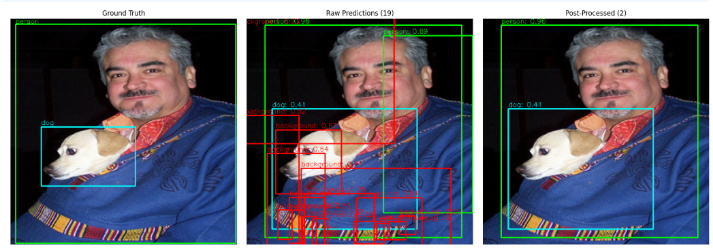
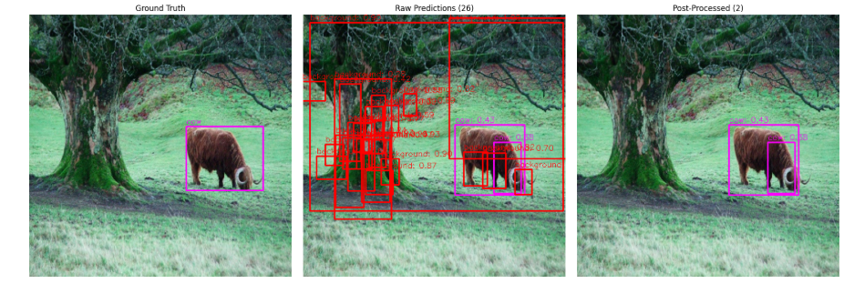
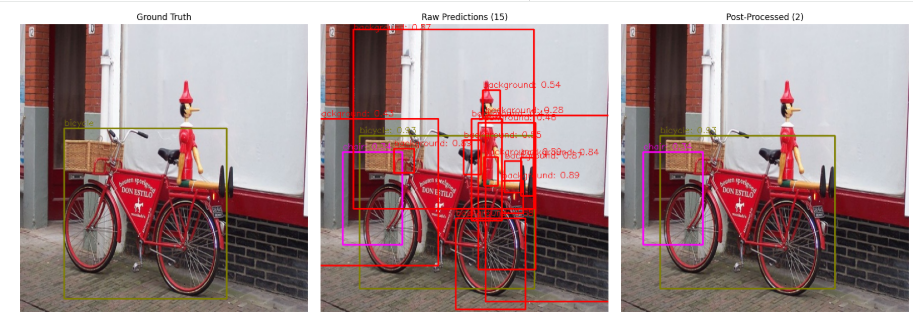

# PyTorch Swin Transformer (Swin-Tiny) & Object Detection

This project was built as a training exercise for me to learn how to code deep learning models in PyTorch. It implements both image classification and object detection pipelines using a minimal version of the Swin Transformer (Swin-Tiny) as the backbone.

## Project Structure

The codebase is split into two main components:

*   **/src**: Contains all the core PyTorch model architectures:
    *   swin_backbone/Swin_V2.py: The core Swin Transformer V2 backbone.
    *   FasterRCNN_head/: The Faster R-CNN implementation (Faster_RCNN.py, Fast_RCNN.py, etc.) for object detection.
    *   Swin_classif.py & Swin_OD.py: The top-level wrappers for Classification and Object Detection tasks respectively.
    *   init_weights.py: Model weight initialization utilities.
    
*   **/training_notebooks**: Contains the Jupyter notebooks used for training and evaluating the models:
    *   pretraining_imageNet.ipynb: Notebook for pretraining the model on ImageNet100.
    *   training_pascal_voc.ipynb: Notebook for fine-tuning the object detection model on the Pascal VOC dataset.

## A Note on Metrics and Compute

The final tracking metrics are not cutting-edge, but there is a good reason for that! Because I am renting a GPU and do not have infinite compute to throw at the problem, I made some cost-saving tradeoffs:

1.  The model is pre-trained only on **ImageNet100** instead of the full ImageNet dataset.
2.  I only implemented the minimal version of the architecture (**Swin-Tiny**) to lower the computational cost.
3.  The architecture of Swin and FasterRCNN are not SOTA but it was a good exercice to learn Pytorch.

Despite these constraints, the results are good enough to validate the architecture and prove that the implementation works correctly which is the purpose.

## Results / Inferences

Here are some visual inferences obtained with the object detection model:

## Feedback

Since this is a learning project, feel free to give advice or open an issue! Any feedback is greatly appreciated and welcome.
